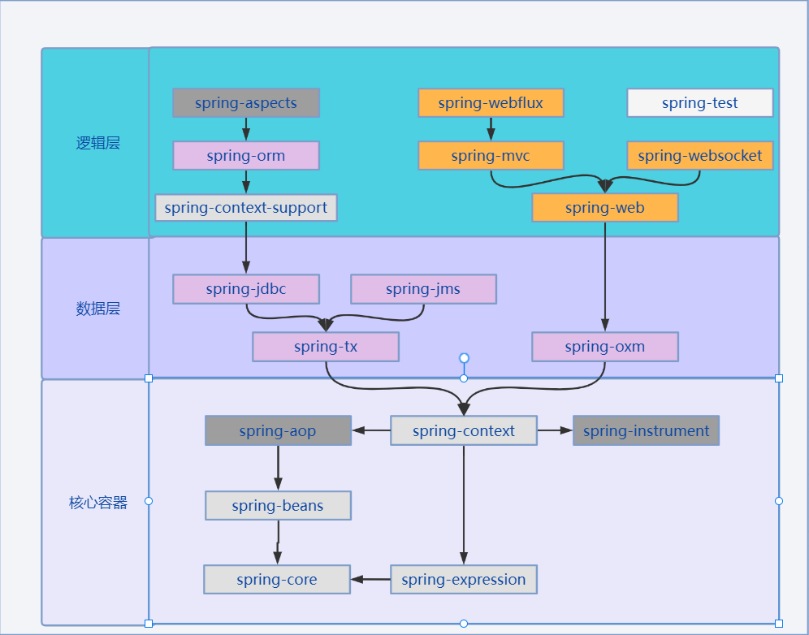
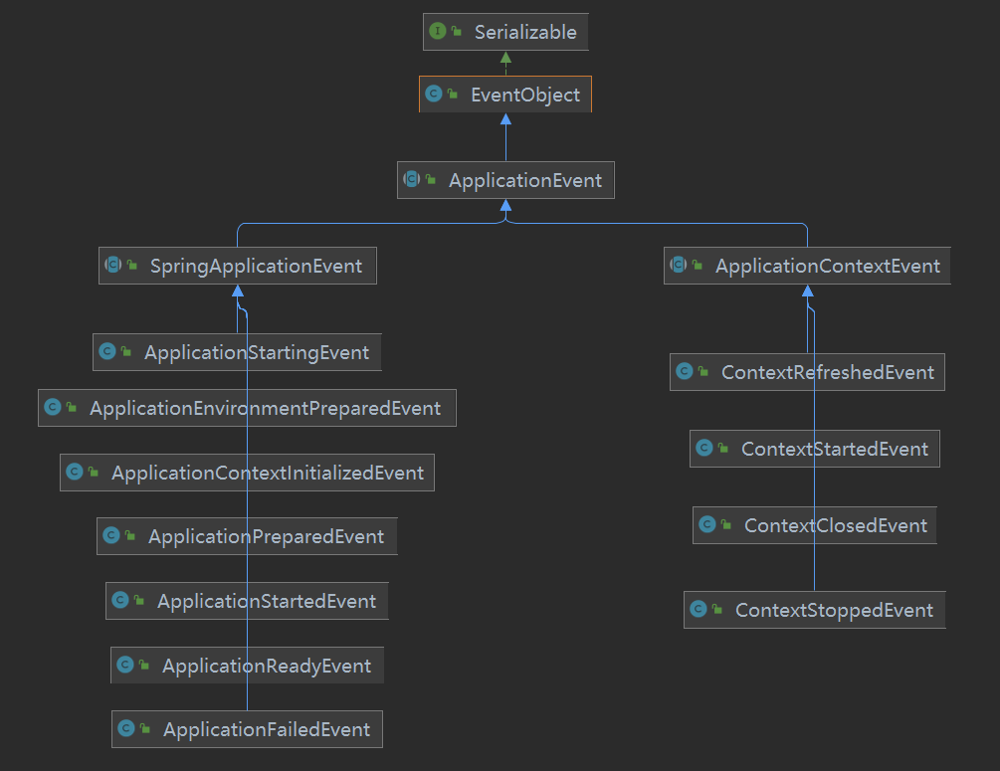

# Spring

## Spring模块

### 分类

根据功能不同，Spring模块可以划分为几大类模块：

1. [核心容器](./modules/spring-core.md)：
   
   包括spring-beans、spring-core、spring-context，spring-expression（Spring Expression Language，SpEL 表达式）,
   
   spring-context-support、spring-context-indexer 等6个模块组成。
   
2. [AOP模块](./modules/spring-aop.md)：

   包括spring-aop、spring-aspects和spring-instrument 3个模块构成。因为核心模块依赖AOP实现，因此严格来说，AOP模块也属于核心模块。

3. [数据访问与集成](./modules/spring-data.md)：

   包括spring-jdbc、spring-tx、spring-orm、spring-oxm和spring-jms 5个模块组成。

4. [web组件](./modules/spring-web.md)：

   包括spring-web、spring-webmvc、spring-websocket和spring-webflux 4个模块组成。

5. 通信报文：

   仅包含spring-messaging模块，它是spring4增加的一个模块，主要职责为Spring框架集成一些基础的报文传送应用。

6. [集成测试](./modules/spring-test.md)：

   单指spring-test模块，主要为单元测试提供支持。

7. 集成兼容：

   单指spring-framework-bom模块，主要解决Spring的不同模块依赖版本不同的问题。

### 依赖关系

 

## Spring核心启动流程

传送门：[核心启动流程](./refresh.md)

## Spring中的ApplicationEvent

在Spring以及SpringBoot中，事件的UML类图如下：

图中包含了四个顶级事件类型，分别是EventObject，是JDK定义的顶级事件类型，ApplicationEvent是Spring应用的顶级事件类型，ApplicationContextEvent是传统Spring项目中顶级事件类型，SpringApplicationEvent是SpringBoot项目中顶级事件类型。

在SpringBoot核心流程启动中，Environment和BeanFactory的初始化是在Spring标准流程前进行的，也就是说ApplicationStartingEvent、ApplicationEnvironmentPreparedEvent、ApplicationContextInitializedEvent、ApplicationPreparedEvent事件的发生是在Spring标准启动流程（AbstractApplicationContext#refresh()）之前发生的，那么SpringBoot是如何将这四种事件进行广播的呢。

> SpringApplicationRunListener是SpringBoot中顶级的事件监听器，其唯一的实现类是EventPublishingRunListener。EventPublishingRunListener中定义的SimpleApplicationEventMulticaster类型的变量，用于事件的广播，其中上述四种事件通过SimpleApplicationEventMulticaster#multicastEvent()方法进行广播，而后续的其他事件由于是在容器已经初始化完成后进行的，因此通过ConfigurableApplicationContext#publishEvent()方法进行广播。
>

