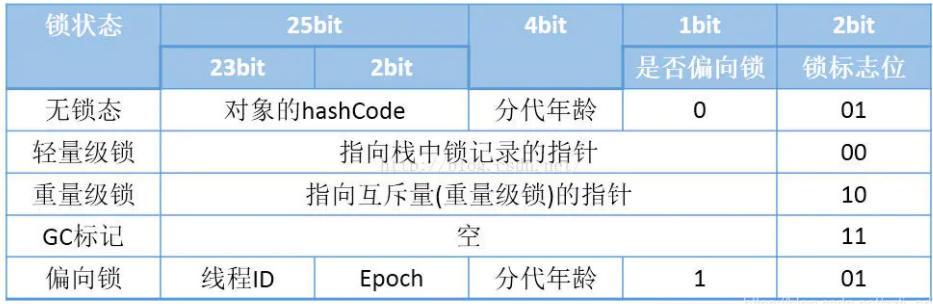

Synchronized实现原理

锁升级过程：只能升级不能降级，但是偏向锁可以暂时性的置为无锁。

无锁  》 偏向锁  》 轻量级锁(自旋锁) 》重量级锁。

锁对象数据结构分为三个部分：

>1. 对象头：由MarkWord和类型指针构成。类型指针指向的是方法区class对象的地址，MarkWord是可变数据结构，保存着对象hashCode 分代年龄 锁标志位等。
>2. 实例变量：对象的属性数据
>3. 填充字节：对象大小必须是4的整数倍字节。不满足的需要使用空字节填充。

1. 无锁 》 偏向锁

   1. 当线程1访问锁对象(执行同步代码快)时，此时锁对象处于无锁状态，线程1使用CAS方法将自己的线程ID写入到锁对象的MarkWord上去，此时从无锁状态变为偏向锁状态。
   2. 当线程2访问锁对象时，锁对象处于偏向锁状态，线程2会匹配偏向锁的线程ID是否是自己，若是则重入，若不是则继续判断线程2是否存活且退出了同步代码快，若是则执行第1步获取偏向锁，否则升级锁为轻量级锁。

2. 偏向锁 》 轻量级锁

   在步骤1.2中，若未获取到偏向锁，则进行锁升级过程。

   1. 线程2将MarkWord复制到自己线程的栈帧中（栈帧中备份称为Displaced MarkWord，这块区域称为Lock Record），同时使用CAS将锁对象的值

