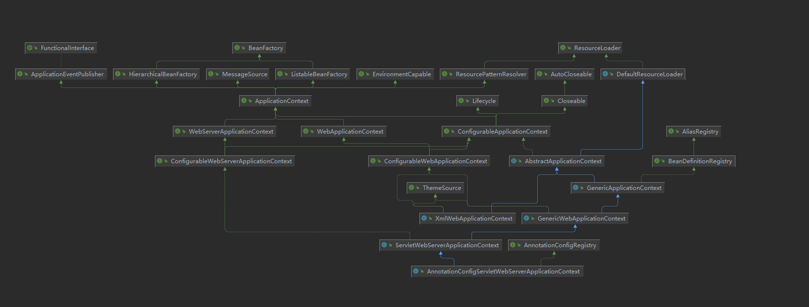

# Spring核心启动流程

Spring核心启动流程是在AbstractApplicationContext#refresh()中实现的。XmlWebApplicationContext是传统web项目中Spring应用上下文的实现类，AnnotationConfigServletWebServerApplicationContext是SpringBoot中应用上下文的实现类。先看下其类图。



从上图中可以看出，AbstractApplicationContext类包含的角色有BeanFactory、EnvironmentCapable环境容器[^1]、ApplicationEventPublisher事件广播器、ResourceLoader资源加载器、MessageSource国际化等。Lifecycle表示该类具有生命周期（start/stop/isRunning）。以下流程介绍中会加以区分Spring传统项目和SpringBoot项目中的区别。无论什么项目，AbstractApplicationContext都定制了其中的大部分流程。通过模板方法（在父类中定义抽象方法，在子类中实现该方法）的模式，得到不同功能的定制。因此理解模板方法各实现类间的区别对于立即Spring核心启动流程至关重要。

## 1. 上下文预设置

```java
prepareRefresh();
```

Spring标准流程，启动前的准备工作，主要包括Spring启动状态、启动时间的设置以及环境变量的初始化。

1. 设置启动时间#startupDate。

2. 设置启动状态#closed=false及#active=true。

3. **模板方法#initPropertySources**，初始化属性源。该属性源是保存在环境Environment中的。比如应用类型为传统web应用(包含web.xml文件)时，此处会将servletContextInitParams和servletConfigInitParams设置到属性源中，方便后续参数的读取，参考PropertySource。

   > Spring中：首先根据当前应用类型实例化环境Environment。然后将ServletContext和ServletConfig的配置信息综合到属性源中。
   >
   > 1. 实例化Environment时，在调用父类AbstractEnvironment的构造函数对子类的#customizePropertySources()方法进行回调，在该方法中完成属性源的初始化工作。
   >
   > Boot中：在之前的Boot定制流程中已经完成了环境Environment和属性源的解析配置，此处无需任何处理。

4. 校验属性源（即#initPropertySources()方法中初始化的属性）中是否包含必须属性。默认不包含必须属性，可通过ConfigurablePropertyResolver#setRequiredProperties进行设置。

5. 设置早期监听器ApplicationListener。

   > Spring中：不存在早期监听器。
   >
   > Boot中：在SpringApplication实例化时，已经从spring.factory文件中加载过对应的监听器。

## 2. 获取新容器

~~~java
ConfigurableListableBeanFactory beanFactory = obtainFreshBeanFactory();
~~~

**模板方法，获取一个刷新后的容器并返回。** 在Spring和Boot中有不同的实现方式，两者的区别主要在是否可刷新上。

Spring中：默认的子类是AbstractRefreshableApplicationContext。

> 1.  判断容器是否已启动。Spring上下文是通过组合模式实现容器BeanFactory功能的，因此判断当前容器是否已启动的逻辑为，在加锁[^2]的前提下，判断属性#beanFactory是否为空即可。
> 2.  销毁容器中的bean实例。
> 3.  关闭容器。
> 4.  实例化一个全新的容器。
> 5.  为当前新容器设置全新的序列化id。该id的组成格式为`className + '@' + hex(hashCode) `。
> 6.  定制当前容器，包含两项内容，是否允许重写BeanDefinition和是否允许嵌套引用。此处由于还未解析属性源，因此都是默认值false。
> 7.  加载BeanDefinition。
>

Boot中：默认的实现类是GenericApplicationContext。

> SpringBoot中在该流程前容器已启动（[传送门](../SpringBoot/README.md)），因此在GenericApplicationContext中设置序列化id后，直接返回当前容器即可。
>
> 1. 通过CAS操作，将#refreshed设置为true，表示容器已经启动。如果操作失败（#refreshed=true时，表示容器已经启动），则抛出异常。

## 3. 容器预设置

```
prepareBeanFactory(beanFactory);	
```

Spring标准流程，预设置是指容器启动前配置一些标准化的特性，比如类加载器、SpEL表达式解析器、Bean后置处理器等。

1. 指定当前容器应该使用的类加载器。如果未指定，按照以下优先级从高到低使用对应的类加载器。Thread.currentThread().getContextClassLoader() > ClassUtils.class.getClassLoader() > ClassLoader.getSystemClassLoader()。

2. 指定SpEL表达式的解析类StandardBeanExpressionResolver。

3. 向容器添加Bean后置处理器ApplicationContextAwareProcessor。ApplicationContextAwareProcessor类从本质上来讲是BeanPostProcessor的实现类，因此其角色是Bean的后置处理器BeanPostProcessor。从功能上来讲，其作用是实现Spring的Aware感知接口的功能组件之一。此处的Aware感知接口仅指以下6类及其子类：EnvironmentAware、EmbeddedValueResolverAware、ResourceLoaderAware、ApplicationEventPublisherAware、MessageSourceAware、ApplicationContextAware。

4. 容器忽略一些指定类型Bean，主要是指一些Aware感知接口（比如EnvironmentAware，ApplicationContextAware等），忽略的原因是这些Bean有特别的角色定义，会在指定的地方进行特殊处理。

5. 针对当前容器，给指定类型接口注入特定的实例。比如BeanFactory、ResourceLoader、ApplicationContext这三者代表不同的角色，但是当前应用上下文充当了这三个角色，因此只需要把当前对象this注入即可。

   > Aware感知接口，顾名思义，Aware接口作用就是为了感知Spring特定内容的一类接口，其子类非常之多，比如上述的EnvironmentAware、EmbeddedValueResolverAware、ResourceLoaderAware、ApplicationEventPublisherAware、MessageSourceAware、ApplicationContextAware和web中的ServletContextAware、ServletConfigAware等。感知是指期望Spring在处理某一些类型的Bean时，将对应类型的Bean注入到该Aware中。比如ApplicationContextAware，如果你自定义的类实现了该接口，那么Spring会将ApplicationContext上下文注入到该类中。其实现的过程如下，1.需定义具体的感知接口和感知接口处理器。感知接口代码层面无限制，但为了知名达意，通常是Aware的子类。感知接口处理器必须是BeanPostProcessor的子类，只有实现了该类，在Bean被实例化后，才能够主动触发针对该Bean的特殊逻辑。

## 4. 容器初始化后设置

```java
postProcessBeanFactory(beanFactory);	
```

**模板方法#postProcessBeanFactory(beanFactory)**，在容器初始化完成、所有BeanDefinition被加载但未实例化之后对当前应用上下文进行定制修改。如果当前应用上下文或者容器需要处理其他特殊逻辑的，可以在之类中对其进行扩展。

Spring中，子类AbstractRefreshableWebApplicationContext对其扩展的内容包含：

> 1. 添加Bean后置处理器ServletContextAwareProcessor，即ServletContext的感知接口功能实现类。
> 2. 忽略ServletContextAware和ServletConfigAware类型的依赖关系，因为该类型为由上述步骤提供依赖关系。
> 3. 注册Scope的几种实例(RequestScope,SessionScope,ServletContextScope)。
> 4. 注册web类型的应用上下文特有的Environment环境contextParameters和contextAttributes。

Boot中，子类ServletWebServerApplicationContext对其扩展的内容包含：

> 1. 添加BeanFactory后置处理器WebApplicationContextServletContextAwareProcessor。
> 2. 忽略ServletContextAware依赖关系。
> 3. 注册Scope的几种实例(RequestScope,SessionScope,ServletContextScope)，同Spring中一样，都是通过WebApplicationContextUtils.registerWebApplicationScopes(beanFactory, this.servletContext)实现的。

## 5. 回调容器后置处理器

~~~java
invokeBeanFactoryPostProcessors(beanFactory);
~~~

Spring标准流程，回调BeanFactory后置处理器BeanFactoryPostProcessors。虽然Spring和Boot都是通过AbstractApplicationContext#invokeBeanFactoryPostProcessors来启动回调容器后置处理器的，但是由于两者预定义的BeanFactory有很大区别，因此流程上也体现出了很的不同。

Spring中，未提供任何内置的后置处理器。

SpringBoot中，则定义了很多内置的BeanFactoryPostProcessor，以完成Spring核心容器的启动工作，内置的后置处理器有以下几种：

> 1. CachingMetadataReaderFactoryPostProcessor：内部类，继承自BeanDefinitionRegistryPostProcessor，因此该后置处理器主要是为了**BeanDefinition的扫描和注册**。该类是通过SharedMetadataReaderFactoryContextInitializer#initialize()注册到#beanFactoryPostProcessors中的。
>
> 2. ConfigurationWarningsPostProcessor：内部类，同样继承自BeanDefinitionRegistryPostProcessor，但是该类主要是为了报告常见的配置错误地警告信息。该类是通过ConfigurationWarningsApplicationContextInitializer#initialize()注册到#beanFactoryPostProcessors中的。
>
> 3. PropertySourceOrderingPostProcessor：内部类。对多个属性源进行排序，确保配置信息能够按照正确的优先级进行读取。
>
>    > 该类是通过监听器ConfigFileApplicationListener注册到#beanFactoryPostProcessors中的。而ConfigFileApplicationListener是注册到spring.factories文件中的，因此在Boot启动中，会加载到该监听器。该监听器只监听两种类型的事件ApplicationEnvironmentPreparedEvent和ApplicationPreparedEvent事件。针对两种事件分别进行了如下操作：
>    >
>    > **针对ApplicationEnvironmentPreparedEvent事件：**
>    >
>    > ​	该事件的触发时机是在SpringApplication#prepareEnvironment()。从spring.factories文件中加载EnvironmentPostProcessor类型的环境后置处理器（该类型是在Boot中定制的接口），按照优先级循环回调#postProcessEnvironment()完成Environment的后置处理。默认实现类有，按照优先级顺序为：
>    >
>    > 1. SystemEnvironmentPropertySourceEnvironmentPostProcessor：name=systemEnvironment的属性源默认实现类是SystemEnvironmentPropertySource，此处将实现类替换为其子类OriginAwareSystemEnvironmentPropertySource，增加OriginLookup功能。
>    > 2. SpringApplicationJsonEnvironmentPostProcessor：处理json格式的属性源。当启动参数或者其他环境变量中存在name=spring.application.json`或者`SPRING_APPLICATION_JSON`时，Boot将会对应json串解析成key-value格式添加到当前属性源中。
>    > 3. CloudFoundryVcapEnvironmentPostProcessor：todo???
>    > 4. **ConfigFileApplicationListener**：添加一个name=random的属性源。从spring.factories文件中读取PropertySourceLoader类的实现类，默认提供了两个实现类PropertiesPropertySourceLoader和YamlPropertySourceLoader分别解析properties和.yml/yaml格式的文件。只加载`spring.profiles.active`配置的文件。
>    > 5. DebugAgentEnvironmentPostProcessor：todo???
>    >
>    > **针对ApplicationPreparedEvent事件：**
>    >
>    > ​	添加BeanFactoryPostProcessor后置处理器PropertySourceOrderingPostProcessor。该事件触发时机是在SpringApplication#prepareContext()方法中。

## 6. 注册bean后置处理器

```
invokeBeanFactoryPostProcessors(beanFactory);	
```

Spring标准流程，从容器中筛选出所有BeanPostProcessor类型，如果该类同时是PriorityOrdered或者Ordered类型，则进行排序。然后分别将有序和无序的BeanPostProcessor添加到当前容器#beanPostProcessors集合中。

## 7. 初始化国际化

```java
initMessageSource();
```

Spring标准流程，Spring国际化是指对多语言的处理。

## 8. 初始化应用广播器

```
initApplicationEventMulticaster();
```

Spring标准流程，Spring广播器ApplicationEventMulticaster是Spring事件通知机制的组件之一。负责下发Spring事件ApplicationEvent。首先判断容器中是否已经注册了名为name=`applicationEventMulticaster`的bean。如果没有，则new一个SimpleApplicationEventMulticaster类型充当事件广播器，并注册到当前容器中。

## 9. 刷新时

```
onRefresh();	
```

模板方法，用于在实例化单例Bean之前，初始化特殊Bean时调用。

Spring中，子类AbstractRefreshableWebApplicationContext的实现如下。

~~~java
@Override
protected void onRefresh() {
    this.themeSource = UiApplicationContextUtils.initThemeSource(this);
}
~~~

SpringBoot中，子类ServletWebServerApplicationContext的实现如下。

~~~java
@Override
protected void onRefresh() {
    super.onRefresh();
    try {
        createWebServer();
    }
    catch (Throwable ex) {
        throw new ApplicationContextException("Unable to start web server", ex);
    }
}

private void createWebServer() {
		WebServer webServer = this.webServer;
		ServletContext servletContext = getServletContext();
		if (webServer == null && servletContext == null) {
			ServletWebServerFactory factory = getWebServerFactory();
			this.webServer = factory.getWebServer(getSelfInitializer());
		}
		else if (servletContext != null) {
			try {
				getSelfInitializer().onStartup(servletContext);
			}
			catch (ServletException ex) {
				throw new ApplicationContextException("Cannot initialize servlet context", ex);
			}
		}
		initPropertySources();
	}
~~~

#createWebServer是实现内嵌Tomcat容器的入口方法。

## 10. 注册监听器

```java
registerListeners();
```

Spring标准流程，Spring监听器ApplicationListener是Spring事件通知机制的组件之一。负责监听Spring事件。从数据结构上来讲，监听器是配置在AbstractApplicationContext#applicationListeners集合中的，但监听器是需要搭配广播器才能完成事件的广播的，因此需要将AbstractApplicationContext#applicationListeners中的监听器通过ApplicationEventMulticaster#addApplicationListener添加到广播器中。注册监听器的过程正是如此。

### 11. 完成容器初始化

```java
finishBeanFactoryInitialization(beanFactory);
```

Spring标准流程，到目前为止，容器已经初始化，环境Environment、BeanDefinition和Bean后置处理器已经被加载到容器中，BeanFactory后置处理器已经回调完成，事件处理器也准备就绪。此处需要将BeanDefinition转化为Spring bean。Spring Bean默认是懒加载模式，因此只需要将**单例且非懒加载模式**的BeanDefinition实例化为bean即可。

### 12. 完成Spring的启动

```java
finishRefresh();
```

Spring标准流程，Spring启动的最后一步，初始化并回调LifecycleProcessor。

1. 清除ResourceCaches。
2. 初始化LifecycleProcessor。lifecycleProcessor可以理解为Lifecycle类型的处理器，但在类关系上是其子类，扩展了两个方法onRefresh和onClose。DefaultLifecycleProcessor是其默认实现类，并且是BeanFactoryAware的子类，因此DefaultLifecycleProcessor中已经包含了当前Ioc容器实例。Lifecycle类包含了三种状态start、stop、isRunning。
3. 回调步骤2中lifecycleProcessor#onRefresh()。
4. 广播器发布ContextRefreshedEvent事件。


------

[^1]: AbstractApplicationContext类通过私有的属性变量`environment`来实现的，具体类型是ConfigurableEnvironment。

[^2]: 该锁对象为一个final类型的Object对象#beanFactoryMonitor。
------

