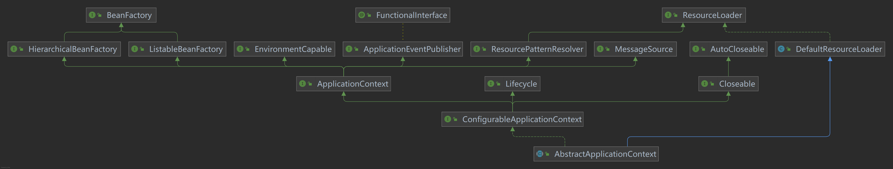

# Spring核心启动流程

Spring核心启动流程是在AbstractApplicationContext#refresh中实现的。先看下其类图。



从上图中可以看出，AbstractApplicationContext类包含的角色有BeanFactory、EnvironmentCapable环境容器[^1]、ApplicationEventPublisher事件广播器、ResourceLoader资源加载器、MessageSource国际化等。Lifecycle表示该类具有生命周期（start/stop/isRunning）。


## 1. 上下文预设置

```java
prepareRefresh();
```

Spring启动前的准备工作，主要包括Spring启动状态、启动时间的设置以及环境变量的初始化。

1. 设置启动时间#startupDate。
2. 设置启动状态#closed=false及#active=true。
3. 初始化属性源。用实际实例替换任何根属性源。比如应用类型为传统web应用(包含web.xml文件)时，此处会将servletContextInitParams和servletConfigInitParams设置到属性源中，方便后续参数的读取。
4. 校验属性源中是否包含必须属性。默认必须属性为空，可通过ConfigurablePropertyResolver#setRequiredProperties进行设置。
5. 设置早期监听器。默认为空，容器启动前，没有事件广播器，故早期监听器也不起作用。
6. 初始化早期事件。默认空集合。

## 2. 获取新容器

~~~java
ConfigurableListableBeanFactory beanFactory = obtainFreshBeanFactory();
~~~

获取一个全新的容器。Spring中默认有两个实现类AbstractRefreshableApplicationContext和GenericApplicationContext。在传统的Spring中使用的是前者，即可刷新容器，而在SpringBoot中使用的是后者。两者的区别主要在是否可刷新上。SpringBoot中在该流程前容器已启动（[传送门](../SpringBoot/README.md)），因此在GenericApplicationContext中设置序列化id后，直接返回当前容器即可。而在AbstractRefreshableApplicationContext中，如果当前容器已启动，则先关闭该容器。然后实例化一个全新的容器，并进行系列的设置。其详细流程如下：

1.  判断容器是否已启动。Spring上下文是通过组合模式实现容器BeanFactory功能的，因此判断当前容器是否已启动的逻辑为，在加锁[^2]的前提下，判断属性#beanFactory是否为空即可。
2.  销毁容器中的bean实例。
3.  关闭容器。
4.  实例化一个全新的容器。
5.  为当前新容器设置全新的序列化id。该id的组成格式为`className + '@' + hex(hashCode) `。
6.  定制当前容器，包含两项内容，是否允许重写BeanDefinition和是否允许嵌套引用。此处由于还未解析属性源，因此都是默认值false。
7.  加载BeanDefinition。

## 3. 容器预设置

```
prepareBeanFactory(beanFactory);	
```

预设置是指容器启动前配置一些标准化的特性，比如类加载器、SpEL表达式解析器、Bean后置处理器等。

1. 指定当前容器应该使用的类加载器。如果未指定，按照以下优先级从高到低使用对应的类加载器。Thread.currentThread().getContextClassLoader() > ClassUtils.class.getClassLoader() > ClassLoader.getSystemClassLoader()。

2. 指定SpEL表达式的解析类StandardBeanExpressionResolver。

3. 向容器添加Bean后置处理器ApplicationContextAwareProcessor。ApplicationContextAwareProcessor类从本质上来讲是BeanPostProcessor的实现类，因此其角色是Bean的后置处理器BeanPostProcessor。从功能上来讲，其作用是实现Spring的Aware感知接口的功能组件之一。此处的Aware感知接口仅指以下6类及其子类：EnvironmentAware、EmbeddedValueResolverAware、ResourceLoaderAware、ApplicationEventPublisherAware、MessageSourceAware、ApplicationContextAware。

4. 容器忽略一些指定类型Bean，主要是指一些Aware感知接口（比如EnvironmentAware，ApplicationContextAware等），忽略的原因是这些Bean有特别的角色定义，会在指定的地方进行特殊处理。

5. 针对当前容器，给指定类型接口注入特定的实例。比如BeanFactory、ResourceLoader、ApplicationContext这三者代表不同的角色，但是当前应用上下文充当了这三个角色，因此只需要把当前对象this注入即可。

   > Aware感知接口，顾名思义，Aware接口作用就是为了感知Spring特定内容的一类接口，其子类非常之多，比如上述的EnvironmentAware、EmbeddedValueResolverAware、ResourceLoaderAware、ApplicationEventPublisherAware、MessageSourceAware、ApplicationContextAware和web中的ServletContextAware、ServletConfigAware等。感知是指期望Spring在处理某一些类型的Bean时，将对应类型的Bean注入到该Aware中。比如ApplicationContextAware，如果你自定义的类实现了该接口，那么Spring会将ApplicationContext上下文注入到该类中。其实现的过程如下，1.需定义具体的感知接口和感知接口处理器。感知接口代码层面无限制，但为了知名达意，通常是Aware的子类。感知接口处理器必须是BeanPostProcessor的子类，只有实现了该类，在Bean被实例化后，才能够主动触发针对该Bean的特殊逻辑。

## 4. 容器初始化后设置

```
postProcessBeanFactory(beanFactory);	
```

AbstractApplicationContext#postProcessBeanFactory(beanFactory)模板方法，方法体为空。在容器预设置之后，如果当前应用上下文或者容器需要处理其他特殊逻辑的，可以在之类中对其进行扩展。比如在其子类AbstractRefreshableWebApplicationContext中，其扩展项包括以下几点：

1. 添加Bean后置处理器ServletContextAwareProcessor，即ServletContext的感知接口功能实现类。
2. 忽略ServletContextAware和ServletConfigAware类型的依赖关系，因为该类型为由上述步骤提供依赖关系。
3. 注册Scope的几种实例(RequestScope,SessionScope,ServletContextScope)。
4. 注册web类型的应用上下文特有的Environment环境contextParameters和contextAttributes。

## 5. 回调容器后置处理器

~~~java
invokeBeanFactoryPostProcessors(beanFactory);
~~~

Spring标准流程，回调BeanFactory后置处理器BeanFactoryPostProcessors。**也是在该方法中，完成了类的扫描，并将BeanDefinition保存在#beanDefinitionMap属性中。**

## 6. 注册bean后置处理器

```
invokeBeanFactoryPostProcessors(beanFactory);	
```

Spring标准流程，从容器中筛选出所有BeanPostProcessor类型，如果该类同时是PriorityOrdered或者Ordered类型，则进行排序。然后分别将有序和无序的BeanPostProcessor添加到当前容器#beanPostProcessors集合中。

## 7. 初始化国际化

```java
initMessageSource();	
```

Spring国际化是指对多语言的处理。

## 8. 初始化应用广播器

```
initApplicationEventMulticaster();
```

Spring广播器ApplicationEventMulticaster是Spring事件通知机制的组件之一。负责下发Spring事件ApplicationEvent。首先判断容器中是否已经注册了名为“applicationEventMulticaster”的bean。如果没有，则new一个SimpleApplicationEventMulticaster类型充当事件广播器，并注册到当前容器中。

## 9. 刷新时

```
onRefresh();	
```

模板方法，在子类AbstractRefreshableWebApplicationContext中主要完成了#themeSource的初始化。

## 10. 注册监听器

```java
registerListeners();
```

Spring监听器ApplicationListener是Spring事件通知机制的组件之一。负责监听Spring事件。从数据结构上来讲，监听器是配置在AbstractApplicationContext#applicationListeners集合中的，但监听器是需要搭配广播器才能完成事件的广播的，因此需要将AbstractApplicationContext#applicationListeners中的监听器通过ApplicationEventMulticaster#addApplicationListener添加到广播器中。注册监听器的过程正是如此。

### 11. 完成容器初始化

```java
finishBeanFactoryInitialization(beanFactory);
```

到目前为止，容器已经初始化，环境Environment、BeanDefinition和Bean后置处理器已经被加载到容器中，BeanFactory后置处理器已经回调完成，事件处理器也准备就绪。此处需要将BeanDefinition转化为Spring bean。Spring Bean默认是懒加载模式，因此只需要将**单例且非懒加载模式**实例化为bean即可。

### 12. 完成Spring的启动

```java
finishRefresh();
```

Spring启动的最后一步，初始化并回调LifecycleProcessor。

1. 清除ResourceCaches。
2. 初始化LifecycleProcessor。lifecycleProcessor可以理解为Lifecycle类型的处理器，但在类关系上是其子类，扩展了两个方法onRefresh和onClose。DefaultLifecycleProcessor是其默认实现类，并且是BeanFactoryAware的子类，因此DefaultLifecycleProcessor中已经包含了当前Ioc容器实例。Lifecycle类包含了三种状态start、stop、isRunning。
3. 回调步骤2中lifecycleProcessor#onRefresh。
4. 广播器发布ContextRefreshedEvent事件。


------

[^1]: AbstractApplicationContext类通过私有的属性变量`environment`来实现的，具体类型是ConfigurableEnvironment。

[^2]: 该锁对象为一个final类型的Object对象#beanFactoryMonitor。
------

