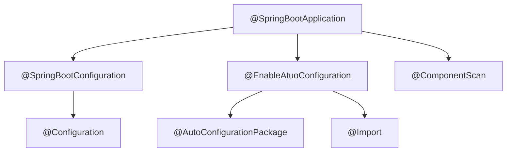

------

@SpringBootApplication =  @EnableAutoConfiguration + @SpringBootConfiguration + @ComponentScan；

------

### @EnableAutoConfiguration

@EnableAutoConfiguration：exclude中指定排除的类必须是在spring.factories文件中由org.springframework.boot.autoconfigure.EnableAutoConfiguration指定的类。被注解的类所在的包为扫描类路径的base路径（所在包和子包所在的包都会被扫描。父包则不会被扫描）。

spring.factories：配置文件，位于META-INF文件下（该文件的也可以配置其他待注册的类型???）。

AutoConfiguration：XXXAutoConfiguration自动配置类。

AutoConfigurationImportSelector：

* selectImports：加载环境spring.boot.enableautoconfiguration配置项。

　													**@ SpringBootApplication组合 结构图**
