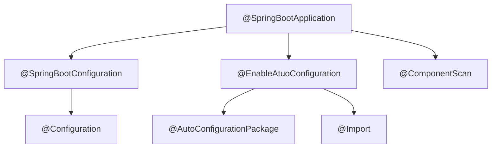

## 核心功能之自动配置

### @SpringBootApplication注解

　													**@ SpringBootApplication组合 结构图**
@SpringBootApplication =  @EnableAutoConfiguration + @SpringBootConfiguration + @ComponentScan；

1. @EnableAutoConfiguration：
   1. 开启自动配置功能，加载各种XXXAutoCOnfiguration。
   2. 被注解的类所在路径为@Entity扫描的根路径。
2. @SpringBootConfiguration：组合了@Configuration注解，表示入口类也可以当做配置类去使用（入口类也可以使用@Bean等）。
3. @ComponentScan：开启自动扫描功能（@Controller/@Service/@Component/@Repository），默认值为当前被注解类所在的路径（因此在默认情况下，SpringBoot入口类必须在最顶级包下）。

------

### @EnableAutoConfiguration

~~~java
@Target(ElementType.TYPE)
@Retention(RetentionPolicy.RUNTIME)
@Documented
@Inherited
@AutoConfigurationPackage
@Import(AutoConfigurationImportSelector.class)
public @interface EnableAutoConfiguration {

	String ENABLED_OVERRIDE_PROPERTY = "spring.boot.enableautoconfiguration";

	Class<?>[] exclude() default {};

	String[] excludeName() default {};
}
~~~

1. **该注解自动配置功能的核心实现者是@AutoConfigurationImportSelector注解。**
2. 可根据环境变量中的spring.boot.enableautoconfiguration的值来开启(true)或关闭(false)自动配置功能，默认开启。
3. exclude指定排除的自动配置类，该类是在spring.factories文件中由org.springframework.boot.autoconfigure.EnableAutoConfiguration指定的类。spring.factories：配置文件，位于META-INF文件下（该文件的也可以配置其他待注册的类型???）。
4. excludeName作用同exclude，通过全类名进行排除。
5. @Import注解功能同xml文件中的<import/>标签，可以导入@Configuration配置类、ImportSelector实现类、普通的POJO等注册为Spring Bean。

> spring.factories文件：位于各个jar包的/META-INF文件下（该文件的也可以配置其他待注册的类型，AutoConfigurationImportFilter、AutoConfigurationImportListener、AutoConfigurationImportListener、ApplicationContextInitializer、ApplicationListener、SpringBootExceptionReporter等）。

------

### @AutoConfigurationImportSelector

~~~java
public interface ImportSelector {
    String[] selectImports(AnnotationMetadata var1);

    @Nullable
    default Predicate<String> getExclusionFilter() {
        return null;
    }
}
~~~

1. ImportSelector，Import选择器，自动选择导入哪些@Configuration配置类。每个实现类代表了一个类型的选择器，比如AutoConfigurationImportSelector表示自动配置选择器，
2. 选择的结果通过selectImports方法实现，参数AnnotationMetadata类型，返回的数组代表将被@Import导入的配置类的全类名。

#selectImports()自动配置流程：

~~~java
@Override
public String[] selectImports(AnnotationMetadata annotationMetadata) {
    if (!isEnabled(annotationMetadata)) {
        return NO_IMPORTS;
    }
    AutoConfigurationMetadata autoConfigurationMetadata = AutoConfigurationMetadataLoader
        .loadMetadata(this.beanClassLoader);
    AutoConfigurationEntry autoConfigurationEntry = getAutoConfigurationEntry(autoConfigurationMetadata,
                                                                              annotationMetadata);
    return StringUtils.toStringArray(autoConfigurationEntry.getConfigurations());
}

protected AutoConfigurationEntry getAutoConfigurationEntry(AutoConfigurationMetadata autoConfigurationMetadata,
			AnnotationMetadata annotationMetadata) {
		if (!isEnabled(annotationMetadata)) {
			return EMPTY_ENTRY;
		}
		AnnotationAttributes attributes = getAttributes(annotationMetadata);
		List<String> configurations = getCandidateConfigurations(annotationMetadata, attributes);
		configurations = removeDuplicates(configurations);
		Set<String> exclusions = getExclusions(annotationMetadata, attributes);
		checkExcludedClasses(configurations, exclusions);
		configurations.removeAll(exclusions);
		configurations = filter(configurations, autoConfigurationMetadata);
		fireAutoConfigurationImportEvents(configurations, exclusions);
		return new AutoConfigurationEntry(configurations, exclusions);
	}
~~~

* 检查自动配置开关（"spring.boot.enableautoconfiguration"配置是否开启，默认开启），关闭状态时直接返回空数组。

* 加载自动配置元数据（META-INF/spring-autoconfigure-metadata. properties）。

  > 1. 加载自动配置元数据的作用是为了过滤不需要或者不符合条件的自动配置类。
  >
  > 2. 该文件格式为：自动配置类的全类名.注解名称=值（多个值用逗号分割）。
  > 3. 自动配置类是指Spring预定义的各种自动配置类（XXXAutoConfiguration），注解是指各种条件化注解（ConditionalOnClass、ConditionalOnBean、ConditionalOnWebApplication、AutoConfigureAfter、AutoConfigureBefore等），值是指需要满足的条件，ConditionalOnBean的值表示容器中需要包含值对应的Bean。

* 加载自动配置组件。

  > 1. 加载各个jar包中META-INF/spring.factories文件中的自动配置类（key等于"org.springframework.boot.autoconfigure.EnableAutoConfiguration"）。
  > 2. 加载的过程是将spring.factories中内容封装成Map<String, List>的过程，String表示配置类型（EnableAutoConfiguration、AutoConfigurationImportFilter、AutoConfigurationImportListener此处为EnableAutoConfiguration）。List表示自动配置类的集合。加载结果将会被缓存。

* 排除指定的组件。

  > 1. 被排除组件是指在@SpringBootApplication(exclude="")指定的自动配置类。
  > 2. 被排除的类必须是在spring.factories中指定的自动配置类（会校验该类是否在自动配置列表中）。

* 过滤自动配置组件。

  > 1. 过滤的目的是排除SpringBoot预定义的自动配置类，比如DataSourceAutoConfiguration。过滤过程参考"加载自动配置元数据"。
  > 2. 过滤器是spring.factories中指定的AutoConfigurationImportFilter类型（默认有三个OnClassCondition、OnBeanCondition、OnWebApplicationCondition）。
  > 3. 过滤的过程是，双层循环对所有过滤器和所有自动配置类进行match()匹配。
  > 4. 自定义过滤器的话，可继承FilteringSpringBootCondition类，实现#getOutcomes()即可。
  > 5. 过滤和排除指定组件的区别在于，前者是排除不满足条件的预定义自动配置类。排除则侧重于开发者手动排除。逻辑上都是为了让指定的自动配置不进行配置。

* 事件注册。

  > 1. 在经过上述步骤后，得到了两个集合，"自动配置"集合 和 "被排除的自动配置"集合。
  > 2. 将两个集合封装成AutoConfigurationImportEvent事件。
  > 3. 从spring.factories缓存中取出所有的AutoConfigurationImportListener监听器类型。
  > 4. 将事件通过监听器广播出去。

------

## SpringBoot启动流程

SpringBoot启动流程分为两个步骤。

1. SpringApplication实例化。
2. Spring Ioc容器启动，即SpringApplication#run的运行。

------

### SpringApplication启动类实例化

~~~java
public SpringApplication(Class<?>... primarySources) {
    this(null, primarySources);
}
public SpringApplication(ResourceLoader resourceLoader, Class<?>... primarySources) {
    this.resourceLoader = resourceLoader;
    Assert.notNull(primarySources, "PrimarySources must not be null");
    this.primarySources = new LinkedHashSet<>(Arrays.asList(primarySources));
    this.webApplicationType = WebApplicationType.deduceFromClasspath();
    setInitializers((Collection) getSpringFactoriesInstances(ApplicationContextInitializer.class));
    setListeners((Collection) getSpringFactoriesInstances(ApplicationListener.class));
    this.mainApplicationClass = deduceMainApplicationClass();
}
~~~

SpringApplication实例化流程：

1. 参数赋值，resourceLoader资源加载器（默认为空，不指定），primarySources启动类。

   > 构造函数的参数为Class类型，因此启动类可以是非当前mian方法所在的类（任何被@SpringBootApplication注解的类都可以）。

2. 推断应用类型（REACTIVE/NONE/SERVLET）。

   > 1. 应用类型通过枚举类型WebApplicationType（REACTIVE响应式、NONE普通、SERVLET web应用）表示。
   >
   > 2. 推断逻辑主要依靠ClassUtils.isPresent()方法，即判断classpath是否存在对应的类有，判断逻辑如下：
   >
   >    > 1. 存在org.springframework.web.reactive.DispatcherHandler类且不存在org.springframework.web.servlet.DispatcherServlet 和 org.glassfish.jersey.servlet.ServletContainer的类是响应式REACTIVE应用。
   >    >
   >    > 2. 不存在javax.servlet.Servlet和org.springframework.web.context.ConfigurableWebApplicationContext的是普通应用。
   >    >
   >    > 3. 其他的都是web应用SERVLET。

3. 获取ApplicationContextInitializer类集合并设置对应属性值。

   > 1. 从spring.factories缓存中获取ApplicationContextInitializer类型的集合。
   > 2. 将上述集合赋值到SpringApplication#initializers属性上。
   > 3. ApplicationContextInitializer类是Spring应用的初始化回调接口，应用在ConfigurableApplicationContext类型（或其子类型）的ApplicationContext做refresh方法调用刷新之前，对ConfigurableApplicationContext实例做进一步的设置或处理。通常用于应用程序上下文进行编程初始化的Web应用程序中。

4. 获取ApplicationListener类集合并设置对应属性值。

   > 1. 从spring.factories缓存中获取ApplicationListener类型的集合。
   > 2. 将上述集合赋值到SpringApplication#listeners属性上。
   > 3. ApplicationListener类是Spring应用监听器。当Spring容器事件ApplicationEvent发布之后，需要处理特定事件时，如数据的加载、初始化缓存、特定任务的注册等操作。而在此阶段，更多的是用于ApplicationContext管理Bean过程的场景。

5. 推断入口类并设置对应属性的值。SpringApplication#mainApplicationClass值。

~~~java
   private Class<?> deduceMainApplicationClass() {
       try {
           StackTraceElement[] stackTrace = new RuntimeException().getStackTrace();
           for (StackTraceElement stackTraceElement : stackTrace) {
               if ("main".equals(stackTraceElement.getMethodName())) {
                   return Class.forName(stackTraceElement.getClassName());
               }
           }
       }
       catch (ClassNotFoundException ex) {
       }
       return null;
   }
~~~

------

### SpringBoot启动流程

SpringBoot启动流程是指SpringApplication#run方法的运行过程。

~~~java
public ConfigurableApplicationContext run(String... args) {
		StopWatch stopWatch = new StopWatch();
		stopWatch.start();
		ConfigurableApplicationContext context = null;
		Collection<SpringBootExceptionReporter> exceptionReporters = new ArrayList<>();
		configureHeadlessProperty();
		SpringApplicationRunListeners listeners = getRunListeners(args);
		listeners.starting();
		try {
			ApplicationArguments applicationArguments = new DefaultApplicationArguments(args);
			ConfigurableEnvironment environment = prepareEnvironment(listeners, applicationArguments);
			configureIgnoreBeanInfo(environment);
			Banner printedBanner = printBanner(environment);
			context = createApplicationContext();
			exceptionReporters = getSpringFactoriesInstances(SpringBootExceptionReporter.class,
					new Class[] { ConfigurableApplicationContext.class }, context);
			prepareContext(context, environment, listeners, applicationArguments, printedBanner);
			refreshContext(context);
			afterRefresh(context, applicationArguments);
			stopWatch.stop();
			if (this.logStartupInfo) {
				new StartupInfoLogger(this.mainApplicationClass).logStarted(getApplicationLog(), stopWatch);
			}
			listeners.started(context);
			callRunners(context, applicationArguments);
		}
		catch (Throwable ex) {
			handleRunFailure(context, ex, exceptionReporters, listeners);
			throw new IllegalStateException(ex);
		}

		try {
			listeners.running(context);
		}
		catch (Throwable ex) {
			handleRunFailure(context, ex, exceptionReporters, null);
			throw new IllegalStateException(ex);
		}
		return context;
	}
~~~

1. 获取监听器。从spring.factories文件中获取获取监听器，获取过程同XXXAutoConfiguration。也可以通过SpringApplication#setListeners设置监听器。两种方法区别，叠加还是覆盖???。

   > SpringApplicationRunListener监听器，该接口定义了SpringBoot的启动过程中的**7种**状态，按照时间先后顺序分别为starting、environmentPrepared、contextPrepared、contextLoaded、started、running、failed。SpringBoot中只定义了一个实现类EventPublishingRunListener。

2. 封装参数配置ApplicationArguments实例对象。

   > ApplicationArguments类组合了Source类，而Source类是SimpleCommandLinePropertySource的子类，可以从main(string [] args)参数中获取java标准参数值。比如 '--name=zs --age=16' 可以获取到对应name和age的值。其中'-'表示是JVM级参数，此处是获取不到的，'--'是应用级参数。

3. 准备环境Environment。环境Environment和配置源PropertySources的区别是PropertySources是载体，配置中的所有属性值都保存在PropertySources中，Environment根据激活状态和优先级取不同PropertySources的内容。

   > 1. 获取或创建Environment对象。当SpringApplication#environment为不为空直接返回该实例值，为空时，根据当前应用类型WebApplicationType创建Environment对应子类型实例。当为servlet类型时，在创建StandardServletEnvironment实例时，会在实例化(父类构造函数调用#customizePropertySources方法)时默认添加四个PropertySources配置源，按照从高到低优先级分别是servletConfigInitParams、servletContextInitParams、systemProperties和systemEnvironment。
   >
   > 2. 配置Environment。配置的内容主要包括转换服务、PropertySources、和activeProfiles。
   >
   > 3. 转换服务ApplicationConversionService。单例模式，默认开启(this.addConversionService=true)。该类的主要作用是参数的转换。
   >
   > 4. 配置源PropertySources。在概念上一个PropertySource代表了一个.properties或者.yml配置文件。此处使用的是其子类MutablePropertySources代表了多个配置源文件，此处配置的目的是多个配置源进行优先级的排序。排序规则如下：
   >
   >    > 1. 如果默认PropertySource配置源this.defaultProperties不为空，则将其放在集合最后，代表优先级最低，其key=defaultProperties。可以通过SpringApplication#setDefaultProperties方法设置默认PropertySource配置源。
   >    > 2. 如果命令参数存在则会出现两种情况：如果配置源中已存在key为'commandLineArgs'的配置源项，则使用CompositePropertySource类进行相同name的参数处理；如果命令的参数并不存在于属性配置中，则新增key为''commandLineArgs''的配置项，直接将其设置为优先级最高，并将命令参数保存在改配置源PropertySource中。
   >    
   > 5. 设置profiles的激活状态。从配置源PropertySources中获取'spring.profiles.active'的值。

4. 配置忽略BeanInfo类的扫描。BeanInfo是Java语言对符合JavaBean规范的抽象（java自省机制.参考jdk的Introspector和spring对BeanInfo接口的扩展类ExtendedBeanInfo）。

5. 打印banner。banner默认为资源文件夹resource下名为banner.txt的文件。

6. 创建Spring应用上下文。如果当前应用上下文不为空（默认为空，可通过SpringApplication#setApplicationContextClass设置），根据'SpringApplication实例化'流程中的'推断应用类型'的结果实例化对应的类。

7. 初始化SpringBoot异常处理类SpringBootExceptionReporter的实例。初始逻辑同spring.factory中其他类型。当SpringBoot启动异常时，回调该实例进行异常处理。

8. 准备应用上下文。Spring应用上下文（或者容器）启动前的准备工作，包括以下内容。

   > 1. 应用上下文 设置/关联 之前流程已初始化的环境Environment。其中关联Environment的有Environment本身、BeanDefinitionReader 和 ClassPathBeanDefinitionScanner，后两项的作用主要体现在Bean的加载上。
   > 2. 应用上下文后置处理器的回调。该方法在SpringApplication中定义为protected，因此子类可以重写该方法，实现更多逻辑处理。默认实现的处理逻辑主要是向容器注册几个单例类型的bean，包括BeanNameGenerator名称生成器、ConversionService类型转换服务、ResourceLoader资源加载器。BeanNameGenerator名称生成器在不通过设置#setBeanNameGenerator指定具体实现类时，此处不会向容器注册。ResourceLoader资源加载器同样如此，只有ConversionService会进行注册关联。
   > 3. 触发ApplicationContextInitializer回调接口。ApplicationContextInitializer的实例在SpringApplication的实例化过程中已经初始化完成。先对所有ApplicationContextInitializer实例进行排序后再进行回调。
   > 4. SpringApplicationRunListener监听器广播contextPrepared事件。
   > 5. 向容器注册springBootBanner。
   > 6. Spring容器设置是否运行覆盖Spring bean。此处this.allowBeanDefinitionOverriding属性还未读取配置源PropertySource中'spring.main.allow-bean-definition-overriding'的值，因此默认为false。

------

分隔符

------

spring.factories文件：位于各个jar包的/META-INF文件下，可配置的类型有

1. 自动配置类：AutoConfigurationImportFilter、AutoConfigurationImportListener、AutoConfigurationImportListener。
2. Ioc容器类：ApplicationContextInitializer、ApplicationListener。
2. 其他类型：SpringBootExceptionReporter

------

Spring中常用工具类

> 1. StringUtils#delimitedListToStringArray
> 2. 

@EnableConfigurationProperties和@ConfigurationProperties搭配实现属性注入。

SimpleCommandLinePropertySource类的用法 可用作 输入参数的工具类。

AbstractEnvironment#validateProfile校验profiles中单独指出不能以'!'开头的原因？

